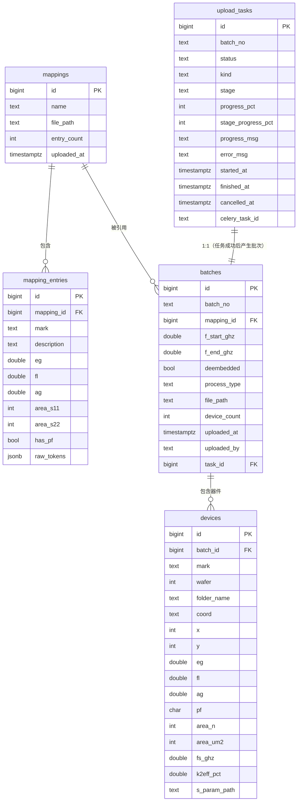

# 数据库 Schema 设计

**版本**：v0.2
**日期**：2026-05-09
**目标 DB**：PostgreSQL 15 / SQLAlchemy 2.0 / Alembic

---

## 0. 变更记录

### v0.2 — 2026-05-09

- 用户决策：mBVD 等效电路参数（C0/Cm/Lm/Rm/R0/Rs 共 6 列）全部废弃，不再入库。
- `devices` 表字段从 32+ 减到 ~26。
- 同步删除：字段表 / DDL / SQLAlchemy ORM / 列名映射表 / 单行字节估算 / 不确定点中相关条目。

---

## 1. 总览

平台一期围绕 **谐振器** 数据，核心是 **批次 → 器件参数行** 的一对多结构，外加独立维护的 **对照表（mapping）** 和上传 **任务进度表**。

### 1.1 表清单

| 表名 | 作用 | 预估行数 |
|---|---|---|
| `batches` | 批次元信息（一次上传 = 一行） | 18 → 几百 |
| `mappings` | 对照表元信息（用户独立上传） | 几十 |
| `mapping_entries` | 对照表内容（每行一个代号） | 几千 |
| `devices` | 谐振器器件参数行（核心表） | 50 万 → 数百万 |
| `upload_tasks` | 上传/处理任务进度（Celery） | 与批次同量级 |

### 1.2 ER 图（mermaid）



---

## 2. 表定义

命名约定：表名复数小写下划线；时间字段统一 `timestamptz`；主键 `bigint generated by default as identity`；客户脚本里带括号/单位/百分号的列名转成 SQL 友好命名（详见 §4 映射表）。

### 2.1 `batches` 批次表

| 字段 | 类型 | 约束 | 默认 | 注释 |
|---|---|---|---|---|
| id | bigint | PK | identity | 主键 |
| batch_no | text | UNIQUE NOT NULL | | 上传文件夹名，如 `T8901P.01` |
| mapping_id | bigint | FK → mappings.id, NOT NULL | | 绑定的对照表 |
| f_start_ghz | double precision | | NULL | 上传时配置的起始频率，NULL 表示全频段 |
| f_end_ghz | double precision | | NULL | 同上，结束频率 |
| deembedded | boolean | NOT NULL | false | 是否做了 ShortOpen 去嵌 |
| process_type | text | NOT NULL CHECK in ('S1P','S2P','BOTH') | 'S1P' | 当前批次的原始数据类型 |
| file_path | text | NOT NULL | | 文件存储区相对路径，如 `batches/T8901P.01/` |
| device_count | integer | NOT NULL | 0 | 冗余字段，用于列表页免 count |
| uploaded_at | timestamptz | NOT NULL | now() | 上传完成时间 |
| uploaded_by | text | NOT NULL | 'anonymous' | 暂存匿名，二期换用户系统 |
| task_id | bigint | FK → upload_tasks.id | NULL | 关联的上传任务 |

```sql
CREATE TABLE batches (
    id            BIGINT GENERATED BY DEFAULT AS IDENTITY PRIMARY KEY,
    batch_no      TEXT        NOT NULL UNIQUE,
    mapping_id    BIGINT      NOT NULL REFERENCES mappings(id) ON DELETE RESTRICT,
    f_start_ghz   DOUBLE PRECISION,
    f_end_ghz     DOUBLE PRECISION,
    deembedded    BOOLEAN     NOT NULL DEFAULT FALSE,
    process_type  TEXT        NOT NULL DEFAULT 'S1P'
                  CHECK (process_type IN ('S1P','S2P','BOTH')),
    file_path     TEXT        NOT NULL,
    device_count  INTEGER     NOT NULL DEFAULT 0,
    uploaded_at   TIMESTAMPTZ NOT NULL DEFAULT now(),
    uploaded_by   TEXT        NOT NULL DEFAULT 'anonymous',
    task_id       BIGINT      REFERENCES upload_tasks(id) ON DELETE SET NULL
);

CREATE INDEX idx_batches_uploaded_at ON batches(uploaded_at DESC);
CREATE INDEX idx_batches_mapping     ON batches(mapping_id);
```

```python
# app/models/batch.py
from datetime import datetime
from sqlalchemy import BigInteger, Boolean, CheckConstraint, ForeignKey, Integer, Text
from sqlalchemy.orm import Mapped, mapped_column, relationship
from .base import Base, TimestampTZ

class Batch(Base):
    __tablename__ = "batches"

    id:           Mapped[int]  = mapped_column(BigInteger, primary_key=True)
    batch_no:     Mapped[str]  = mapped_column(Text, unique=True, index=True)
    mapping_id:   Mapped[int]  = mapped_column(ForeignKey("mappings.id"))
    f_start_ghz:  Mapped[float | None]
    f_end_ghz:    Mapped[float | None]
    deembedded:   Mapped[bool] = mapped_column(Boolean, default=False)
    process_type: Mapped[str]  = mapped_column(Text, default="S1P")
    file_path:    Mapped[str]  = mapped_column(Text)
    device_count: Mapped[int]  = mapped_column(Integer, default=0)
    uploaded_at:  Mapped[datetime] = mapped_column(TimestampTZ, server_default="now()")
    uploaded_by:  Mapped[str]  = mapped_column(Text, default="anonymous")
    task_id:      Mapped[int | None] = mapped_column(ForeignKey("upload_tasks.id"))

    mapping:  Mapped["Mapping"] = relationship(back_populates="batches")
    devices:  Mapped[list["Device"]] = relationship(back_populates="batch",
                                                    cascade="all, delete-orphan")

    __table_args__ = (
        CheckConstraint("process_type IN ('S1P','S2P','BOTH')", name="ck_batch_proc"),
    )
```

### 2.2 `mappings` 对照表（元信息）

| 字段 | 类型 | 约束 | 注释 |
|---|---|---|---|
| id | bigint | PK | |
| name | text | UNIQUE NOT NULL | 用户起的名字，如 `ELB003` |
| file_path | text | NOT NULL | 原始 .xlsx 存储路径 |
| entry_count | integer | NOT NULL DEFAULT 0 | 解析出的行数 |
| uploaded_at | timestamptz | NOT NULL DEFAULT now() | |

```sql
CREATE TABLE mappings (
    id          BIGINT GENERATED BY DEFAULT AS IDENTITY PRIMARY KEY,
    name        TEXT        NOT NULL UNIQUE,
    file_path   TEXT        NOT NULL,
    entry_count INTEGER     NOT NULL DEFAULT 0,
    uploaded_at TIMESTAMPTZ NOT NULL DEFAULT now()
);
```

```python
class Mapping(Base):
    __tablename__ = "mappings"
    id:          Mapped[int] = mapped_column(BigInteger, primary_key=True)
    name:        Mapped[str] = mapped_column(Text, unique=True)
    file_path:   Mapped[str] = mapped_column(Text)
    entry_count: Mapped[int] = mapped_column(Integer, default=0)
    uploaded_at: Mapped[datetime] = mapped_column(TimestampTZ, server_default="now()")

    entries: Mapped[list["MappingEntry"]] = relationship(back_populates="mapping",
                                                         cascade="all, delete-orphan")
    batches: Mapped[list["Batch"]]        = relationship(back_populates="mapping")
```

### 2.3 `mapping_entries` 对照表条目

| 字段 | 类型 | 约束 | 注释 |
|---|---|---|---|
| id | bigint | PK | |
| mapping_id | bigint | FK → mappings.id ON DELETE CASCADE | |
| mark | text | NOT NULL | 代号，如 `A1-1` |
| description | text | | 原始描述串，如 `EG0 FL0 700&5500` |
| eg | double precision | | 解析出的 EG |
| fl | double precision | | |
| ag | double precision | | |
| area_s11 | integer | | 解析自 `700&5500` 前段 |
| area_s22 | integer | | 解析自后段 |
| has_pf | boolean | NOT NULL DEFAULT false | 是否含 Pass/Fail 列 |
| raw_tokens | jsonb | | 兜底，存所有解析 token |
| | UNIQUE (mapping_id, mark) | | |

```sql
CREATE TABLE mapping_entries (
    id          BIGINT GENERATED BY DEFAULT AS IDENTITY PRIMARY KEY,
    mapping_id  BIGINT NOT NULL REFERENCES mappings(id) ON DELETE CASCADE,
    mark        TEXT   NOT NULL,
    description TEXT,
    eg          DOUBLE PRECISION,
    fl          DOUBLE PRECISION,
    ag          DOUBLE PRECISION,
    area_s11    INTEGER,
    area_s22    INTEGER,
    has_pf      BOOLEAN NOT NULL DEFAULT FALSE,
    raw_tokens  JSONB,
    UNIQUE (mapping_id, mark)
);

CREATE INDEX idx_mentry_mapping ON mapping_entries(mapping_id);
```

```python
class MappingEntry(Base):
    __tablename__ = "mapping_entries"
    id:          Mapped[int] = mapped_column(BigInteger, primary_key=True)
    mapping_id:  Mapped[int] = mapped_column(ForeignKey("mappings.id", ondelete="CASCADE"))
    mark:        Mapped[str] = mapped_column(Text)
    description: Mapped[str | None]
    eg:          Mapped[float | None]
    fl:          Mapped[float | None]
    ag:          Mapped[float | None]
    area_s11:    Mapped[int | None]
    area_s22:    Mapped[int | None]
    has_pf:      Mapped[bool] = mapped_column(Boolean, default=False)
    raw_tokens:  Mapped[dict | None] = mapped_column(JSONB)

    mapping: Mapped["Mapping"] = relationship(back_populates="entries")
    __table_args__ = (UniqueConstraint("mapping_id", "mark"),)
```

### 2.4 `devices` 器件参数行（核心表）

~26 列全部入库，命名 SQL 化（去括号、单位变后缀、百分号变 `_pct`）。

| 字段 | 类型 | 约束/默认 | 注释 |
|---|---|---|---|
| id | bigint | PK identity | |
| batch_id | bigint | FK → batches.id ON DELETE CASCADE, NOT NULL | |
| original_filename | text | NOT NULL | 原始 S1P 文件名 |
| display_name | text | | 翻译后的展示名 |
| mark | text | | 从文件名解析的代号，如 `A1-1`，方便联表 |
| wafer | smallint | | wafer 编号 |
| folder_name | text | | `S11` 或 `S22` |
| coord | text | | `X-1Y-1` |
| x | smallint | | |
| y | smallint | | |
| eg | double precision | | EG 值（脚本内可能是 0.75 这类浮点） |
| fl | double precision | | |
| ag | double precision | | 客户脚本里有，T8601K 表里没；保留 |
| pf | char(1) | CHECK in ('Y','N') | Pass/Fail |
| area_n | integer | | 原 `Area`（编号/类别） |
| area_um2 | integer | | 原 `Area(um2)` |
| fs_ghz | double precision | | |
| fp_ghz | double precision | | |
| zs_ohm | double precision | | |
| zp_ohm | double precision | | |
| qs | double precision | | |
| qp | double precision | | |
| qs_bodeq | double precision | | |
| qp_bodeq | double precision | | |
| dbqs | double precision | | |
| dbqp | double precision | | |
| bodeq_fitted | double precision | | |
| bodeq_smooth | double precision | | |
| bodeq_raw | double precision | | 脚本 §666 已实现 |
| fbode_ghz | double precision | | |
| k2eff_pct | double precision | | |
| fp2_ghz | double precision | NULL | 中间峰，多数器件无 |
| fs2_ghz | double precision | NULL | |
| zp2_ohm | double precision | NULL | |
| zs2_ohm | double precision | NULL | |
| deembedded | boolean | NOT NULL DEFAULT false | 该行是否经过去嵌（与 batches.deembedded 一致，冗余便于跨批次过滤） |
| s_param_path | text | | 该器件 S1P 文件相对路径，曲线现读现画用 |

DDL（节选，列已按上表完整列出）：

```sql
CREATE TABLE devices (
    id                BIGINT GENERATED BY DEFAULT AS IDENTITY PRIMARY KEY,
    batch_id          BIGINT      NOT NULL REFERENCES batches(id) ON DELETE CASCADE,
    original_filename TEXT        NOT NULL,
    display_name      TEXT,
    mark              TEXT,
    wafer             SMALLINT,
    folder_name       TEXT,
    coord             TEXT,
    x                 SMALLINT,
    y                 SMALLINT,
    eg                DOUBLE PRECISION,
    fl                DOUBLE PRECISION,
    ag                DOUBLE PRECISION,
    pf                CHAR(1)     CHECK (pf IN ('Y','N')),
    area_n            INTEGER,
    area_um2          INTEGER,
    fs_ghz            DOUBLE PRECISION,
    fp_ghz            DOUBLE PRECISION,
    zs_ohm            DOUBLE PRECISION,
    zp_ohm            DOUBLE PRECISION,
    qs                DOUBLE PRECISION,
    qp                DOUBLE PRECISION,
    qs_bodeq          DOUBLE PRECISION,
    qp_bodeq          DOUBLE PRECISION,
    dbqs              DOUBLE PRECISION,
    dbqp              DOUBLE PRECISION,
    bodeq_fitted      DOUBLE PRECISION,
    bodeq_smooth      DOUBLE PRECISION,
    bodeq_raw         DOUBLE PRECISION,
    fbode_ghz         DOUBLE PRECISION,
    k2eff_pct         DOUBLE PRECISION,
    fp2_ghz           DOUBLE PRECISION,
    fs2_ghz           DOUBLE PRECISION,
    zp2_ohm           DOUBLE PRECISION,
    zs2_ohm           DOUBLE PRECISION,
    deembedded        BOOLEAN     NOT NULL DEFAULT FALSE,
    s_param_path      TEXT
);

-- 见 §3 索引策略
```

```python
# app/models/device.py
class Device(Base):
    __tablename__ = "devices"

    id:                Mapped[int] = mapped_column(BigInteger, primary_key=True)
    batch_id:          Mapped[int] = mapped_column(ForeignKey("batches.id", ondelete="CASCADE"))

    # 来源元信息
    original_filename: Mapped[str]
    display_name:      Mapped[str | None]
    mark:              Mapped[str | None] = mapped_column(Text, index=True)
    wafer:             Mapped[int | None] = mapped_column(SmallInteger)
    folder_name:       Mapped[str | None]
    coord:             Mapped[str | None]
    x:                 Mapped[int | None] = mapped_column(SmallInteger)
    y:                 Mapped[int | None] = mapped_column(SmallInteger)

    # 类别 / 工艺
    eg:       Mapped[float | None]
    fl:       Mapped[float | None]
    ag:       Mapped[float | None]
    pf:       Mapped[str | None]  = mapped_column(CHAR(1))
    area_n:   Mapped[int | None]
    area_um2: Mapped[int | None]

    # 主峰
    fs_ghz: Mapped[float | None]
    fp_ghz: Mapped[float | None]
    zs_ohm: Mapped[float | None]
    zp_ohm: Mapped[float | None]
    qs: Mapped[float | None]
    qp: Mapped[float | None]
    qs_bodeq: Mapped[float | None]
    qp_bodeq: Mapped[float | None]
    dbqs: Mapped[float | None]
    dbqp: Mapped[float | None]
    bodeq_fitted: Mapped[float | None]
    bodeq_smooth: Mapped[float | None]
    bodeq_raw:    Mapped[float | None]
    fbode_ghz:    Mapped[float | None]
    k2eff_pct:    Mapped[float | None]

    # 中间峰
    fp2_ghz: Mapped[float | None]
    fs2_ghz: Mapped[float | None]
    zp2_ohm: Mapped[float | None]
    zs2_ohm: Mapped[float | None]

    deembedded:   Mapped[bool] = mapped_column(Boolean, default=False)
    s_param_path: Mapped[str | None]

    batch: Mapped["Batch"] = relationship(back_populates="devices")
```

### 2.5 `upload_tasks` 任务进度表

| 字段 | 类型 | 约束 | 注释 |
|---|---|---|---|
| id | bigint | PK | |
| batch_no | text | NOT NULL | 提前占位，处理失败可清 |
| status | text | NOT NULL CHECK in ('pending','running','success','failed','cancelled') | |
| kind | text | NOT NULL DEFAULT 'upload' CHECK in ('upload','reextract','redeembed','recompute') | 任务类型 |
| stage | text | NOT NULL DEFAULT 'extract' CHECK in ('extract','deembed','metrics','done','failed') | 当前阶段 |
| progress_pct | smallint | NOT NULL DEFAULT 0 CHECK (0–100) | |
| stage_progress_pct | smallint | NOT NULL DEFAULT 0 CHECK (0–100) | 当前阶段内进度 |
| progress_msg | text | | 当前步骤描述，如「拆分 S2P：3210/9876」 |
| error_msg | text | NULL | |
| started_at | timestamptz | NOT NULL DEFAULT now() | |
| finished_at | timestamptz | NULL | |
| cancelled_at | timestamptz | NULL | 取消时间 |
| celery_task_id | text | | |

```sql
CREATE TABLE upload_tasks (
    id                 BIGINT GENERATED BY DEFAULT AS IDENTITY PRIMARY KEY,
    batch_no           TEXT        NOT NULL,
    status             TEXT        NOT NULL DEFAULT 'pending'
                       CHECK (status IN ('pending','running','success','failed','cancelled')),
    kind               TEXT        NOT NULL DEFAULT 'upload'
                       CHECK (kind IN ('upload','reextract','redeembed','recompute')),
    stage              TEXT        NOT NULL DEFAULT 'extract'
                       CHECK (stage IN ('extract','deembed','metrics','done','failed')),
    progress_pct       SMALLINT    NOT NULL DEFAULT 0
                       CHECK (progress_pct BETWEEN 0 AND 100),
    stage_progress_pct SMALLINT    NOT NULL DEFAULT 0
                       CHECK (stage_progress_pct BETWEEN 0 AND 100),
    progress_msg       TEXT,
    error_msg          TEXT,
    started_at         TIMESTAMPTZ NOT NULL DEFAULT now(),
    finished_at        TIMESTAMPTZ,
    cancelled_at       TIMESTAMPTZ,
    celery_task_id     TEXT
);

CREATE INDEX idx_uptask_status_started ON upload_tasks(status, started_at DESC);
```

```python
class UploadTask(Base):
    __tablename__ = "upload_tasks"
    id:                 Mapped[int]  = mapped_column(BigInteger, primary_key=True)
    batch_no:           Mapped[str]
    status:             Mapped[str]  = mapped_column(Text, default="pending")
    kind:               Mapped[str]  = mapped_column(Text, default="upload")
    stage:              Mapped[str]  = mapped_column(Text, default="extract")
    progress_pct:       Mapped[int]  = mapped_column(SmallInteger, default=0)
    stage_progress_pct: Mapped[int]  = mapped_column(SmallInteger, default=0)
    progress_msg:       Mapped[str | None]
    error_msg:          Mapped[str | None]
    started_at:         Mapped[datetime] = mapped_column(TimestampTZ, server_default="now()")
    finished_at:        Mapped[datetime | None] = mapped_column(TimestampTZ)
    cancelled_at:       Mapped[datetime | None] = mapped_column(TimestampTZ)
    celery_task_id:     Mapped[str | None]
```

> 注意：`batches.task_id` 与 `upload_tasks.id` 互相引用，迁移时先建 `upload_tasks`，再建 `batches`，外键 `ON DELETE SET NULL` 避免循环约束。

---

## 3. 索引策略

### 3.1 devices 表（重点）

| 索引 | 类型 | 用途 |
|---|---|---|
| `(batch_id, wafer)` | B-tree 复合 | 单批次/单 wafer 列表与翻页 |
| `(eg, fl, ag)` | B-tree 复合 | 跨批次按工艺族筛选（最常见的散点/箱型组合） |
| `(coord)` | B-tree | 按坐标定位（罕见但便宜） |
| `(x, y)` | B-tree 复合 | 版图分布图按矩形范围扫描 |
| `(pf)` WHERE pf='Y' | **Partial** | Pass 数据查询是主路径，索引体积只占 12% 行（样例 88% Fail） |
| `(fs_ghz)` WHERE pf='Y' | **Partial** | 频率范围筛选 + 散点图，Fail 行不进图 |
| `(mark)` | B-tree | 调试与跨批次按代号联表 |

不建：`qs/qp/k2eff_pct` 单列索引——这些是结果列，散点图通常已经被前置筛选（batch + eg/fl + pf）大幅缩小集合，再过 sequential scan 加排序代价可控；维护写入成本不划算。

### 3.2 其他表

| 表 | 索引 | 用途 |
|---|---|---|
| batches | `batch_no UNIQUE`, `(uploaded_at DESC)`, `(mapping_id)` | 列表分页 |
| mappings | `name UNIQUE` | 上传时按名查 |
| mapping_entries | `(mapping_id)`, UNIQUE `(mapping_id, mark)` | 查某 mapping 的所有条目 |
| upload_tasks | `(status, started_at DESC)` | 任务面板 |

### 3.3 50 万行索引体积估算

每个 B-tree 索引 ≈ 18–25 MB（每 row ~40 B），上面 6 个索引共计 ~150 MB，在 PG 缓冲池里轻松常驻。

---

## 4. 列名映射表（业务名 ↔ SQL 列名）

| 客户脚本 / Excel 列名 | SQL 列名 | 类型 | 备注 |
|---|---|---|---|
| original_filename | original_filename | text | |
| display_name | display_name | text | |
| Wafer | wafer | smallint | |
| folder_name | folder_name | text | S11 / S22 |
| coord | coord | text | |
| X | x | smallint | |
| Y | y | smallint | |
| EG | eg | double | |
| FL | fl | double | |
| AG | ag | double | 表里没出现，脚本里有 |
| PF | pf | char(1) | |
| Area | area_n | integer | 避免与 area_um2 撞名 |
| Area(um2) | area_um2 | integer | |
| fs(GHz) | fs_ghz | double | |
| fp(GHz) | fp_ghz | double | |
| Zs(Ω) | zs_ohm | double | |
| Zp(Ω) | zp_ohm | double | |
| Qs | qs | double | |
| Qp | qp | double | |
| Qs_BodeQ | qs_bodeq | double | |
| Qp_BodeQ | qp_bodeq | double | |
| dbqs | dbqs | double | |
| dbqp | dbqp | double | |
| BodeQ_fitted | bodeq_fitted | double | |
| BodeQ_smooth | bodeq_smooth | double | |
| BodeQ_raw | bodeq_raw | double | |
| Fbode(GHz) | fbode_ghz | double | |
| k2eff(%) | k2eff_pct | double | |
| fp2(GHz) | fp2_ghz | double | nullable |
| fs2(GHz) | fs2_ghz | double | |
| Zp2(Ω) | zp2_ohm | double | |
| Zs2(Ω) | zs2_ohm | double | |
| deembedded | deembedded | boolean | |
| (新增) | mark | text | 文件名解析 |
| (新增) | s_param_path | text | 曲线现读现画 |

前端展示时通过统一字典反向翻译（保留括号/单位/Ω 等给科研用户）。建议把字典放在 `app/schemas/columns.py` 中，便于前后端共享。

---

## 5. 查询模式举例

### 5.1 按 EG/FL 筛选 + Qs 散点图（最多 10 万点）

```sql
SELECT fs_ghz, qs, eg, fl, batch_id
FROM devices
WHERE pf = 'Y'
  AND eg = 0.5
  AND fl = 0.0
  AND fs_ghz BETWEEN 4.5 AND 5.5
ORDER BY id            -- 稳定顺序，不走 random
LIMIT 100000;
```

走 `(eg, fl, ag)` 复合索引 + `pf='Y'` 部分索引交叉。如果点数 > 10 万，应用层走 `TABLESAMPLE SYSTEM (n)` 或随机取模降采样，避免回传过大。

### 5.2 单批次器件列表 + 翻页（keyset）

```sql
-- 第一页
SELECT id, original_filename, coord, fs_ghz, qs, k2eff_pct, pf
FROM devices
WHERE batch_id = $1
ORDER BY id
LIMIT 50;

-- 后续页（基于上一页最后一行的 id）
SELECT ...
FROM devices
WHERE batch_id = $1 AND id > $last_id
ORDER BY id
LIMIT 50;
```

走 `(batch_id, wafer)` 索引 + 主键。避免 `OFFSET`（深翻页 N 越大越慢）。

### 5.3 版图分布图（X/Y + Qs 颜色编码）

```sql
SELECT x, y, qs
FROM devices
WHERE batch_id = $1
  AND wafer    = $2
  AND pf       = 'Y';
```

单 wafer ~10 000 行，秒回。前端按 `qs` 着色。

### 5.4 跨批次工艺趋势（每批次 Qs 中位数）

```sql
SELECT b.batch_no,
       percentile_cont(0.5) WITHIN GROUP (ORDER BY d.qs) AS qs_p50,
       percentile_cont(0.5) WITHIN GROUP (ORDER BY d.qp) AS qp_p50
FROM devices d
JOIN batches b ON b.id = d.batch_id
WHERE d.eg = 0.5 AND d.fl = 0.0 AND d.pf = 'Y'
GROUP BY b.batch_no, b.uploaded_at
ORDER BY b.uploaded_at;
```

500 万行下 ~1–2 秒（命中 `(eg, fl, ag)`）。

---

## 6. Alembic 迁移大纲

```
alembic/
├── env.py              # target_metadata = Base.metadata
├── alembic.ini
└── versions/
    └── 0001_initial.py # mappings, mapping_entries, upload_tasks, batches, devices
```

`0001_initial.py` 创建顺序（无环依赖）：

1. `mappings`
2. `mapping_entries`（FK → mappings）
3. `upload_tasks`
4. `batches`（FK → mappings, upload_tasks）
5. `devices`（FK → batches）
6. 最后 `op.create_index(...)`，包括两个 partial index（`postgresql_where=`）

后续可能演进点（每条对应一个 revision）：

| revision | 内容 |
|---|---|
| 0002_add_filter_tables | 滤波器入口（filters / filter_responses 表） |
| 0003_add_users | 二期用户系统，把 `uploaded_by` 改 FK |
| 0004_add_audit_log | 审计：谁删了谁的批次 |
| 0005_partition_devices | 行数破千万时按 batch_id 范围分区 |

---

## 7. 数据规模与性能预估

### 7.1 单行字节估算（devices）

- 数值列 ~30 个 × 8 B = 240 B
- text 列（filename / display / coord / s_param_path）平均 ~200 B
- TOAST/page header / null bitmap ~24 B
- **单行 ≈ 460 B**

### 7.2 总数据量

| 行数 | 表大小 | 索引大小 | 总占用 |
|---|---|---|---|
| 50 万 | ~230 MB | ~150 MB | ~380 MB |
| 500 万（5 倍扩展） | ~2.3 GB | ~1.5 GB | ~3.8 GB |

`/data3/aln/pgdata` 容量充裕，不构成瓶颈。

### 7.3 关键查询性能（EXPLAIN 思路）

- **单批次列表（5.2）**：走 `(batch_id, wafer)` index scan，单页 50 行 < 5 ms。
- **散点筛选（5.1）**：`pf='Y'` partial + `(eg, fl, ag)` 命中后剩 ~5 万行，回表后排序 < 200 ms。
- **趋势 (5.4)**：500 万行下走 `(eg, fl, ag)` partial 命中 ~50 万，hash agg 1–2 秒，可接受；若变热点再加物化视图。
- **版图分布（5.3）**：单 wafer ~10 000 行 index scan，~50 ms。

写入侧：单批次 ~30 000 行用 `COPY` 入库 ~3–5 秒，索引重建摊销在写入；瓶颈不在 DB 而在拆 S2P / 算 Q。

---

> 文档约 4200 字，覆盖建表、ORM、索引、迁移、查询四方面。前端展示字典与 Pydantic schema 在 §4 字典基础上派生。
